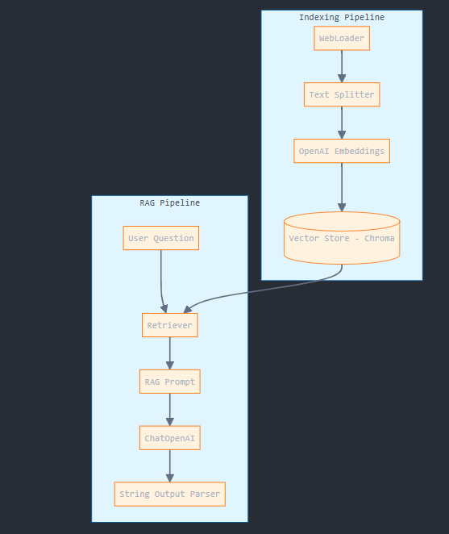

# RAG Q&A Application Documentation

## Overview
This Retrieval Augmented Generation (RAG) Q&A application is designed to answer questions about web content using advanced natural language processing techniques. The system combines document retrieval with language model generation to provide accurate, context-aware responses to user queries. The current implementation is specifically configured to answer questions about the "LLM Powered Autonomous Agents" blog post, but can be adapted for other content sources.

## Requirements

- Python 3.8+
- pip or conda package manager
- OpenAI API key
- Sufficient memory for document processing and vector storage
- Internet connection for web content retrieval

## Prerequisites
Before running the application, ensure you have:

- A valid OpenAI API key
- Basic understanding of Python and package management
- Familiarity with command-line operations
- Understanding of RAG systems (recommended but not required)

## Installation

### Install required packages:

```bash
pip install --quiet --upgrade langchain langchain-community langchain-chroma
pip install -qU langchain-openai
```

### Set up environment variables:
    
```bash
import os
import getpass

os.environ["OPENAI_API_KEY"] = getpass.getpass()
   ```

### Install additional dependencies:
    
```bash
pip install bs4  # for web scraping
   ```

## Running the RAG Q&A Application

1. Initialize the components:
    
    ```python
    from langchain_openai import ChatOpenAI
    from langchain_community.document_loaders import WebBaseLoader
    from langchain_text_splitters import RecursiveCharacterTextSplitter
    from langchain_chroma import Chroma
    from langchain_openai import OpenAIEmbeddings
   ``` 
2. Load the document content:
    
    ```python
    loader = WebBaseLoader(
    web_paths=("your_url_here",),
    bs_kwargs=dict(
    parse_only=bs4.SoupStrainer(
    class_=("your-target-classes")
    )
    ),
    )
    docs = loader.load()
   
   text_splitter = RecursiveCharacterTextSplitter(chunk_size=1000, chunk_overlap=200)
    splits = text_splitter.split_documents(docs)
   vectorstore = Chroma.from_documents(documents=splits, embedding=OpenAIEmbeddings())
   ```

3. Set up the RAG chain:
    
    ```python
    from langchain_core.runnables import RunnablePassthrough
    from langchain_core.output_parsers import StrOutputParser
   
   rag_chain = (
    {"context": retriever | format_docs, "question": RunnablePassthrough()}
    | prompt
    | llm
    | StrOutputParser()
    )
   ```

4. Query the system:
    
    ```python
    response = rag_chain.invoke("Your question here")
   ```

## Architectural Design



## High-Level Architecture
The system is composed of two main pipelines:

### Indexing Pipeline
- Document Loading (WebLoader)
- Text Processing (RecursiveCharacterTextSplitter)
- Embedding Generation (OpenAI Embeddings)
- Vector Storage (Chroma)

### RAG Pipeline
- Query Processing
- Context Retrieval
- Prompt Construction
- Answer Generation
- Response Formatting

## Data Flow

### Document Processing Flow
1. Web content is fetched and parsed
2. Documents are split into manageable chunks
3. Chunks are embedded and stored in the vector database

### Query Processing Flow
1. User question is received
2. Relevant chunks are retrieved from vector store
3. Context and question are combined in a prompt
4. LLM generates the final answer

## System Components Integration
The system uses a pipeline architecture where:
- Components are loosely coupled
- Data flows sequentially through the system
- Each component performs a specific task
- Error handling and monitoring are available at each step

## Technical Architecture Details
- **Vector Dimension**: Based on OpenAI's embedding model
- **Chunk Size**: 1000 characters with 200 character overlap
- **Retrieval Method**: Similarity search with customizable k value
- **Response Generation**: GPT-4 model with custom prompting

## Explanation of Components

### 1. Document Loader (WebLoader)
**Purpose**: Fetches and parses web content  
**Features**:
- Custom HTML parsing
- BeautifulSoup integration
- Flexible URL handling

### 2. Text Splitter (RecursiveCharacterTextSplitter)
**Purpose**: Chunks documents into processable segments  
**Features**:
- Recursive splitting strategy
- Configurable chunk size and overlap
- Metadata preservation

### 3. Embeddings (OpenAIEmbeddings)
**Purpose**: Converts text into vector representations  
**Features**:
- High-quality semantic embeddings
- Efficient vector generation
- Compatible with OpenAI's latest models

### 4. Vector Store (Chroma)
**Purpose**: Stores and retrieves vector embeddings  
**Features**:
- Fast similarity search
- Persistent storage
- Metadata management

### 5. RAG Chain
**Purpose**: Orchestrates the question-answering process  
**Features**:
- Modular component architecture
- Streaming support
- Customizable prompting

### 6. LLM Integration (ChatOpenAI)
**Purpose**: Generates natural language responses  
**Features**:
- Context-aware generation
- Configurable parameters
- Stream output support

## Conclusion
This RAG Q&A application demonstrates a robust architecture for building question-answering systems over web content. The modular design allows for easy modifications and extensions, while the use of state-of-the-art components ensures high-quality results.

### Key advantages:
- Scalable architecture
- Modular component design
- High-quality response generation
- Flexible content handling

### Future improvements could include:
- Multiple content source support
- Enhanced error handling
- Response caching
- User feedback integration
- Performance optimization

## Built With
- Git - Version Control System
- LangChain - Framework for creating applications with large language models
- Jupyter Notebook - Interactive development environment
- OpenAI API - API for accessing OpenAI's language models

## Authors
- Jose Samuel Mahecha Alarcon

## LICENSE
This project is licensed under the MIT License - see the [LICENSE.md](LICENSE.md) file for details.